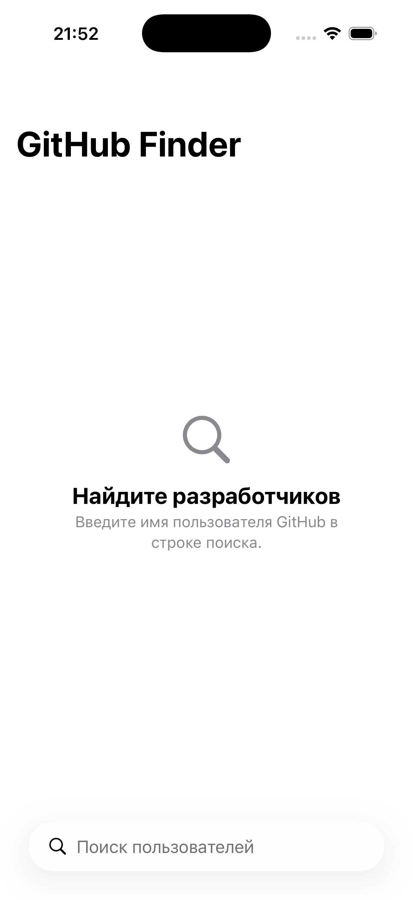

# GitHub Finder

A small iOS app for searching GitHub users, browsing their profiles and exploring
their repositories. Built with **SwiftUI** and the public **GitHub REST API** —
no third-party dependencies.

<p align="center">
  
</p>

## Features

- 🔍 **Search users** — find GitHub users by username with live, debounced search
- 👤 **User profile** — avatar, bio, company/location, repo & follower counts, link to GitHub
- 📦 **Repositories** — a user's repos sorted by stars, with language and description

## Tech stack

- **Swift 6** with strict concurrency
- **SwiftUI** (`@Observable`, `NavigationStack`, `.searchable`)
- **URLSession + async/await** for networking
- **MVVM** with an enum-namespacing screen convention
- No external dependencies

## Architecture

The app uses MVVM where **each screen is its own `enum` namespace**. The enum
groups the screen's root view, its view model, and any sub-views, so types never
collide and you always know what a type belongs to from its name.

```
GitHubFinder/
├── GitHubFinderApp.swift     # @main → Search.view()
├── Models/                   # GitHubUser, UserDetail, Repository (Codable)
├── Services/                 # GitHubService (+ GitHubServicing protocol)
├── CommonViews/              # views shared across screens (e.g. AvatarView)
└── Screens/
    ├── Search/
    │   ├── Search.swift           # enum Search + static func view()
    │   ├── Search.Screen.swift    # struct Screen: View
    │   ├── Search.ViewModel.swift # @Observable ViewModel
    │   └── Views/                 # Search.UserRow, ...
    └── Profile/
        ├── Profile.swift
        ├── Profile.Screen.swift
        ├── Profile.ViewModel.swift
        └── Views/                 # Profile.Header, Profile.RepositoryRow
```

Per screen `<Name>`:

| File | Contents |
|------|----------|
| `<Name>.swift` | `enum <Name> {}` + `static func view() -> some View` |
| `<Name>.Screen.swift` | `extension <Name> { struct Screen: View }` |
| `<Name>.ViewModel.swift` | `extension <Name> { @MainActor @Observable final class ViewModel }` |
| `Views/<Name>.<View>.swift` | extra sub-views: `extension <Name> { struct <View>: View }` |

The root view is named **`Screen`** (not `View`) so it doesn't shadow the SwiftUI
`View` protocol — keeping plain `View` usable everywhere. Views shared by multiple
screens live in `CommonViews/` without a namespace.

## Getting started

Requirements: **Xcode 26+**, iOS Simulator.

```bash
git clone git@github.com:markvoskresensky/GitHubFinder.git
cd GitHubFinder
open GitHubFinder.xcodeproj
```

Then run with **⌘R**. Or build from the command line:

```bash
xcodebuild -scheme GitHubFinder \
  -destination 'generic/platform=iOS Simulator' -configuration Debug build
```

> **Note:** the app uses the public GitHub API without a token, which is limited
> to **60 requests/hour**. Heavy testing may hit the limit (you'll see a
> rate-limit message).

## License

MIT
