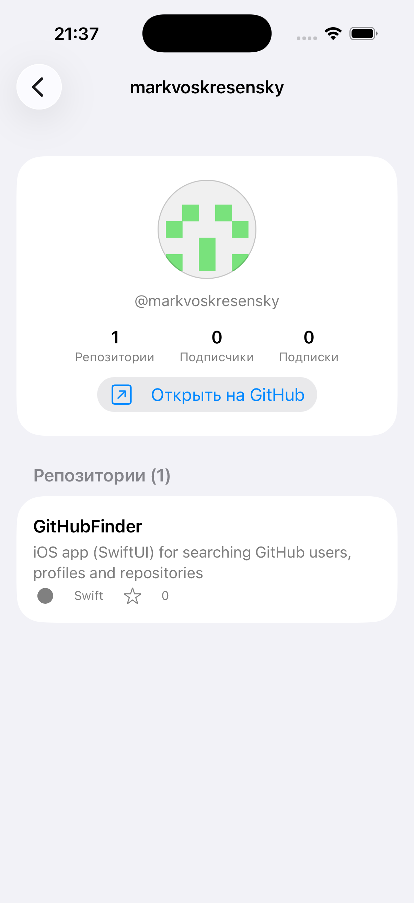

# GitHub Finder

A small iOS app for searching GitHub users, browsing their profiles and exploring
their repositories. Built with **SwiftUI** and the public **GitHub REST API** —
no third-party dependencies.

<p align="center">
  
  &nbsp;&nbsp;
  
</p>

## Features

- 🔍 **Search users** — find GitHub users by username with live, debounced search
- 👤 **User profile** — avatar, bio, company/location, repo & follower counts, link to GitHub
- 📦 **Repositories** — a user's repos sorted by stars, with language and description

## Getting started

Requirements: **Xcode 26+**, iOS Simulator.

```bash
git clone git@github.com:markvoskresensky/GitHubFinder.git
cd GitHubFinder
open GitHubFinder.xcodeproj
```

Then run with **⌘R**. Or build from the command line:

```bash
xcodebuild -scheme GitHubFinder \
  -destination 'generic/platform=iOS Simulator' -configuration Debug build
```

> **Note:** the app uses the public GitHub API without a token, which is limited
> to **60 requests/hour**. Heavy testing may hit the limit (you'll see a
> rate-limit message).

## License

MIT
